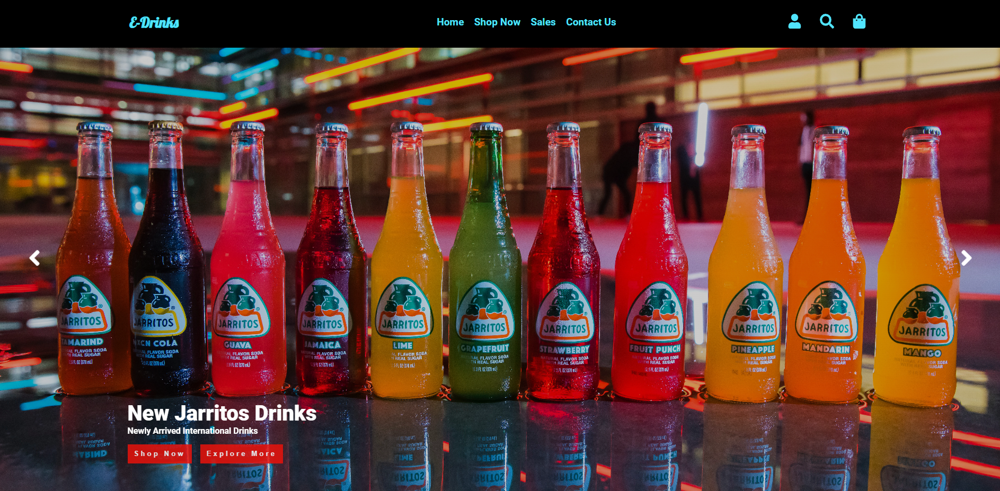

# E-Drinks - Beverage

This is a responsive soft-drink e-commerce webpage built with React JS, Redux, and Styled-Components.

    
    
    %20Styled%20Components-grey?style=flat"/>

    

## About The Project

E-Drinks is a fictional online beverage e-commerce that is built around the React framework, utilising both Redux and Styled Components. This project is specialised for the front-end of the landing page of the website with a focus on small interactive features like an image carousel and hamburger menu. The development process allowed me to be introduced to both Redux data layers and styling using Styled Components.

### Features

- [x] Responsive design
- [x] Image carousel
- [x] Hamburger Menu

## Built With

- [React JS](https://reactjs.org/docs/getting-started.html)
- [Redux](https://redux.js.org/introduction/getting-started)
- [React Redux](https://react-redux.js.org/introduction/getting-started)
- [Styled-Components](https://styled-components.com/docs)
- [React Reveal](https://www.react-reveal.com/) for the fade animation
- [Font Awesome Icons](https://fontawesome.com)

### Live Site

https://jonathancklee1.github.io/soft-drink-webstore

## Acknowledgments

- CleverProgrammer - [Building the Tesla Clone with ReactJS (Redux + Styled Components)
  ](https://www.youtube.com/watch?v=lUeS9Wsj6dk&t=106s) for tutorial

- [G-fuel](https://gfuel.com/en-au) for design inspiration
